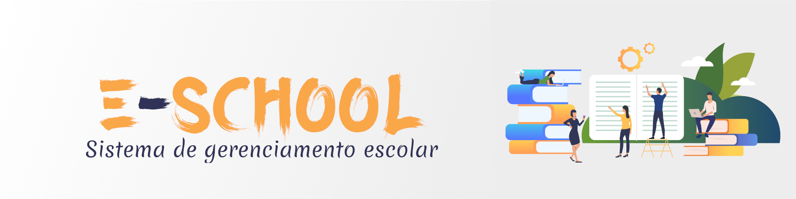

**E-School** é projeto voltado para necessidades das instituições de ensino de gerenciar em um único sistema todos os dados e processos escolares, com o objetivo de aumentar a produtividade pedagógica e diminuir a complexidade administrativa.

## 🚀 Missão

Nossa missão é simples: ajudar as escolas no que realmente importa - **educar**.

### Mas como?

:arrow_up: Produtividade pedagógica; 

:arrow_up: Retenção dos alunos;

:arrow_down: Taxa de inadimplência; 

:white_check_mark: Melhoria dos processos internos;

:white_check_mark: Acompanhamento do desempenho dos professores e alunos; 

## ⚒️ Tecnologias

Para desenvolver o sistema serão utilizadas as seguintes tecnologias:

### Backend

* [ASP. NET Core](https://docs.microsoft.com/pt-br/aspnet/core/)
* [Entity Framework Core](https://docs.microsoft.com/pt-br/ef/)
* [AutoMapper](https://automapper.org/)
* [Swagger](https://swagger.io/)
* [Serilog](https://serilog.net/)
  
#### Banco de Dados
* [PostgreSQL](https://www.postgresql.org/)

#### Autenticação e Autorização
* [Asp.Net Core Identity](https://docs.microsoft.com/pt-br/aspnet/core/security/authentication/identity)
* [JWT](https://jwt.io/)

#### Test-Driven Development - TDD

* [xUnit](https://docs.microsoft.com/pt-br/dotnet/core/testing/unit-testing-with-dotnet-test)
* [Moq](https://github.com/Moq/moq4/wiki/Quickstart)

#### Validation
* [Model validation](https://docs.microsoft.com/pt-br/aspnet/core/mvc/models/validation)
* [FluentValidation](https://docs.fluentvalidation.net/en/latest/aspnet.html)
### Frontend

> _Em avaliação_

## 📚 Referências

* ### [Apreendendo a Arquitetura Cebola em .Net 5](https://djesusnet.medium.com/apreendendo-a-arquitetura-cebola-em-net-5-d2e06dcc9e8)